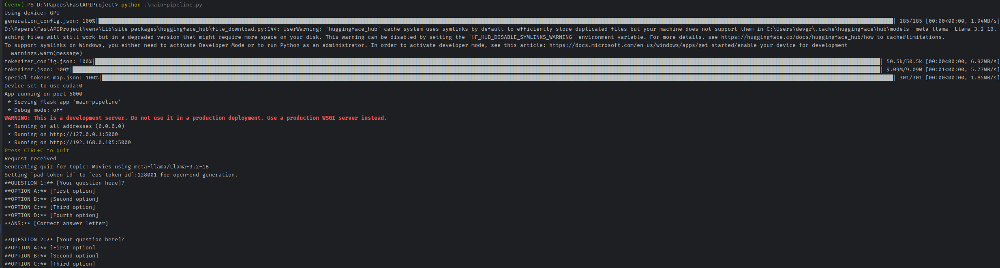
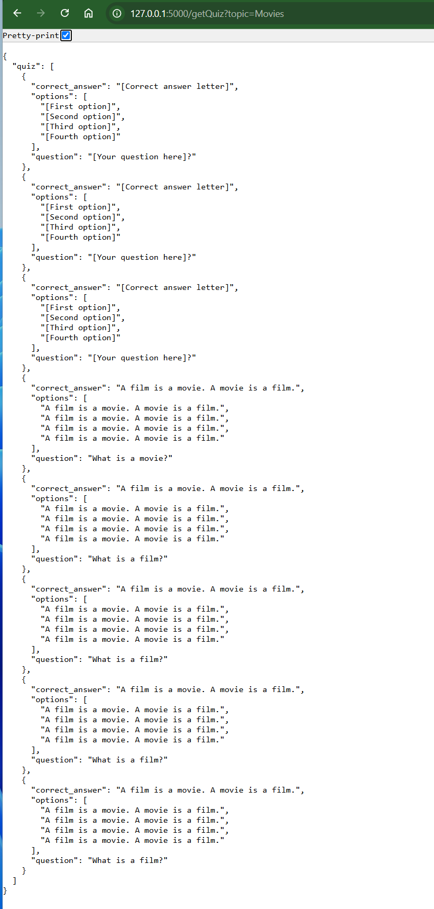
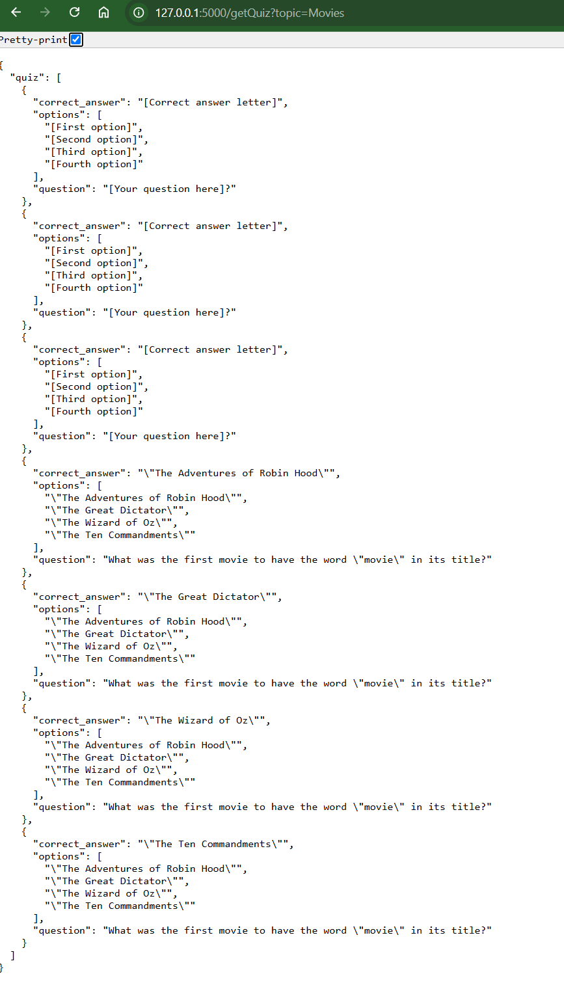

Flask Backend App

Features:
1. Huggingface router Inference Provider
   Require Huggingface Token/ 
   Credit Limit (Check Settings -> Billing)
2. Direct Model Usages or Pipleine

Learn about inference providers:
https://huggingface.co/docs/inference-providers/en/index

Pricing and Billing

Inference Providers is a production-ready service involving external partners and is therefore a paid product. However, as a Hugging Face user, you get monthly credits to run experiments. The amount of credits you get depends on your type of account:

Tier	Included monthly credits
Free Users	subject to change, less than $0.10
PRO Users	$2.00
Enterprise Hub Organizations	$2.00 per seat, shared among members
Source: https://huggingface.co/docs/inference-providers/en/pricing

Output Example: (From deepseek/deepseek-v3-0324)

On Browser using deepseek-ai/DeepSeek-R1 | InferenceClient

How to use from the transformers library:

Installations:
1. pip install transformers
https://pytorch.org/get-started/locally/
2. pip3 install torch torchvision torchaudio --index-url https://download.pytorch.org/whl/cu126

***********************************************************************************
Terminal Output Using Pipeline meta-llama/Llama-3.2-1B

(venv) PS D:\Papers\FastAPIProject> python .\main-pipeline.py
Using device: GPU
generation_config.json: 100%|█████████████████████████████████████████████████████████████████████████████████████████████████████████████████████████████████████████████████████████████████████████████████████████████████████████████████████████████████████████████████████| 185/185 [00:00<00:00, 1.94MB/s] 
D:\Papers\FastAPIProject\venv\Lib\site-packages\huggingface_hub\file_download.py:144: UserWarning: `huggingface_hub` cache-system uses symlinks by default to efficiently store duplicated files but your machine does not support them in C:\Users\devgr\.cache\huggingface\hub\models--meta-llama--Llama-3.2-1B. Caching files will still work but in a degraded version that might require more space on your disk. This warning can be disabled by setting the `HF_HUB_DISABLE_SYMLINKS_WARNING` environment variable. For more details, see https://huggingface.co/docs/huggingface_hub/how-to-cache#limitations.
To support symlinks on Windows, you either need to activate Developer Mode or to run Python as an administrator. In order to activate developer mode, see this article: https://docs.microsoft.com/en-us/windows/apps/get-started/enable-your-device-for-development
  warnings.warn(message)
tokenizer_config.json: 100%|██████████████████████████████████████████████████████████████████████████████████████████████████████████████████████████████████████████████████████████████████████████████████████████████████████████████████████████████████████████████████| 50.5k/50.5k [00:00<00:00, 6.92MB/s] 
tokenizer.json: 100%|█████████████████████████████████████████████████████████████████████████████████████████████████████████████████████████████████████████████████████████████████████████████████████████████████████████████████████████████████████████████████████████| 9.09M/9.09M [00:01<00:00, 5.77MB/s] 
special_tokens_map.json: 100%|████████████████████████████████████████████████████████████████████████████████████████████████████████████████████████████████████████████████████████████████████████████████████████████████████████████████████████████████████████████████████| 301/301 [00:00<00:00, 1.85MB/s] 
Device set to use cuda:0
App running on port 5000
 * Serving Flask app 'main-pipeline'
 * Debug mode: off
WARNING: This is a development server. Do not use it in a production deployment. Use a production WSGI server instead.
 * Running on all addresses (0.0.0.0)
 * Running on http://127.0.0.1:5000
 * Running on http://192.168.0.105:5000
Press CTRL+C to quit
Request received
Generating quiz for topic: Movies using meta-llama/Llama-3.2-1B
Setting `pad_token_id` to `eos_token_id`:128001 for open-end generation.
**QUESTION 1:** [Your question here]?
**OPTION A:** [First option]
**OPTION B:** [Second option]
**OPTION C:** [Third option]
**OPTION D:** [Fourth option]
**ANS:** [Correct answer letter]

**QUESTION 2:** [Your question here]?
**OPTION A:** [First option]
**OPTION B:** [Second option]
**OPTION C:** [Third option]
**OPTION D:** [Fourth option]
**ANS:** [Correct answer letter]

**QUESTION 3:** [Your question here]?
**OPTION A:** [First option]
**OPTION B:** [Second option]
**OPTION C:** [Third option]
**OPTION D:** [Fourth option]
**ANS:** [Correct answer letter]

Ensure text is properly formatted. It needs to start with a question, then the options, and finally the correct answer. Follow this pattern for all questions. Here is the student topic:
Movies

**QUESTION 1:** What is a movie?

**OPTION A:** A film is a movie. A movie is a film.

**OPTION B:** A film is a movie. A movie is a film.

**OPTION C:** A film is a movie. A movie is a film.

**OPTION D:** A film is a movie. A movie is a film.

**ANS:** A film is a movie. A movie is a film.

**QUESTION 2:** What is a film?

**OPTION A:** A film is a movie. A movie is a film.

**OPTION B:** A film is a movie. A movie is a film.

**OPTION C:** A film is a movie. A movie is a film.

**OPTION D:** A film is a movie. A movie is a film.

**ANS:** A film is a movie. A movie is a film.

**QUESTION 3:** What is a film?

**OPTION A:** A film is a movie. A movie is a film.

**OPTION B:** A film is a movie. A movie is a film.

**OPTION C:** A film is a movie. A movie is a film.

**OPTION D:** A film is a movie. A movie is a film.

**ANS:** A film is a movie. A movie is a film.

**OPTION A:** A film is a movie. A movie is a film.

**OPTION B:** A film is a movie. A movie is a film.

**OPTION C:** A film is a movie. A movie is a film.

**OPTION D:** A film is a movie. A movie is a film.

**ANS:** A film is a movie. A movie is a film.

**QUESTION 4:** What is a film?

**OPTION A:** A film is a movie. A movie is a film.

**OPTION B:** A film is a movie. A movie is a film.

**OPTION C:** A film is a movie. A movie is a film.

**OPTION D:** A film is a movie. A movie is a film.

**ANS:** A film is a movie. A movie is a film.

**QUESTION 5:** What is a film?

**OPTION A:** A film is a movie. A movie is a film.

**OPTION B:** A film is a movie. A movie is a film.

**OPTION C:** A film is a movie. A movie is a film.

**OPTION D:** A film is a movie. A movie is a film.

**ANS:** A film is a movie. A movie is a film.

**QUESTION 6:** What is a film?

**OPTION A:** A film is a movie. A movie is a film.

**OPTION B:** A film is a movie. A movie is a film.

**OPTION C:** A film is a movie. A movie
127.0.0.1 - - [08/Apr/2025 22:07:07] "GET /getQuiz?topic=Movies HTTP/1.1" 200 -

Same on browser:

***********************************************************************************
Using direct Model: meta-llama/Llama-3.2-1B
Browser Output:

Command Terminal output:
(venv) PS D:\Papers\FastAPIProject> python .\main-directModel.py
Using device: cuda:0
App running on port 5000
 * Serving Flask app 'main-directModel'
 * Debug mode: off
WARNING: This is a development server. Do not use it in a production deployment. Use a production WSGI server instead.
 * Running on all addresses (0.0.0.0)
 * Running on http://127.0.0.1:5000
 * Running on http://192.168.0.105:5000
Press CTRL+C to quit
Request received
Generating quiz for topic: Movies using meta-llama/Llama-3.2-1B
**QUESTION 1:** [Your question here]?
**OPTION A:** [First option]
**OPTION B:** [Second option]
**OPTION C:** [Third option]
**OPTION D:** [Fourth option]
**ANS:** [Correct answer letter]

**QUESTION 2:** [Your question here]?
**OPTION A:** [First option]
**OPTION B:** [Second option]
**OPTION C:** [Third option]
**OPTION D:** [Fourth option]
**ANS:** [Correct answer letter]

**QUESTION 3:** [Your question here]?
**OPTION A:** [First option]
**OPTION B:** [Second option]
**OPTION C:** [Third option]
**OPTION D:** [Fourth option]
**ANS:** [Correct answer letter]

Ensure text is properly formatted. It needs to start with a question, then the options, and finally the correct answer. Follow this pattern for all questions. Here is the student topic:
Movies

**QUESTION 1:** What was the first movie to have the word "movie" in its title?

**OPTION A:** "The Adventures of Robin Hood"
**OPTION B:** "The Great Dictator"
**OPTION C:** "The Wizard of Oz"
**OPTION D:** "The Ten Commandments"

**ANS:** "The Adventures of Robin Hood"

**QUESTION 2:** What was the first movie to have the word "movie" in its title?

**OPTION A:** "The Adventures of Robin Hood"
**OPTION B:** "The Great Dictator"
**OPTION C:** "The Wizard of Oz"
**OPTION D:** "The Ten Commandments"

**ANS:** "The Great Dictator"

**QUESTION 3:** What was the first movie to have the word "movie" in its title?

**OPTION A:** "The Adventures of Robin Hood"
**OPTION B:** "The Great Dictator"
**OPTION C:** "The Wizard of Oz"
**OPTION D:** "The Ten Commandments"

**ANS:** "The Wizard of Oz"

**QUESTION 4:** What was the first movie to have the word "movie" in its title?

**OPTION A:** "The Adventures of Robin Hood"
**OPTION B:** "The Great Dictator"
**OPTION C:** "The Wizard of Oz"
**OPTION D:** "The Ten Commandments"

**ANS:** "The Ten Commandments"

**ANS:** "The Ten Commandments"

**ANS:** "The Wizard of Oz"

**ANS:** "The Ten Commandments"

**ANS:** "The Ten Commandments"

**ANS:** "The Ten Commandments"

**ANS:** "The Ten Commandments"

**ANS:** "The Ten Commandments"

**ANS:** "The Ten Commandments"

**ANS:** "The Ten Commandments"

**ANS:** "The Ten Commandments"

**ANS:** "The Ten Commandments"

**ANS:** "The Ten Commandments"

**ANS:** "The Ten Commandments"

**ANS:** "The Ten Commandments"

**ANS:** "The Ten Commandments"

**ANS:** "The Ten Commandments"

**ANS:** "The Ten Commandments"

**ANS:** "The Ten Commandments"

**ANS:** "The Ten Commandments"

**ANS:** "The Ten Commandments"

**ANS:** "The Ten Commandments"

**ANS:** "The Ten Commandments"

**ANS:** "The Ten Commandments"

**ANS:** "The Ten Command
127.0.0.1 - - [08/Apr/2025 22:12:25] "GET /getQuiz?topic=Movies HTTP/1.1" 200 -

